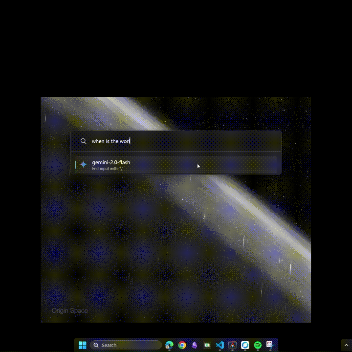

# LLLM - PowerToys Run Plugin for LLM Integration

A PowerToys Run plugin that allows you to query LLM models directly from the PowerToys Run interface.

## Features

- Query LLM models without leaving your keyboard
- Configure custom endpoints for different LLM providers (WIP)
- Supports Google Gemini API out-of-the-box
- Access to google search
- Utility Commands such as:
   - /screenshot, which will attach screenshot of the current screen to the query
      - This will hide powertoys run and take a screenshot of the current screen
      - The screenshot will be attached to the query automatically
- Copy LLM responses to clipboard with a single click
- Customizable system prompt to control LLM behavior

## Installation

1. Build the project or download the latest release
2. Copy the compiled files to your PowerToys Run plugins directory:
   - Typically: `%LOCALAPPDATA%\Microsoft\PowerToys\PowerToys Run\Plugins`
3. Restart PowerToys

## Usage

1. Open PowerToys Run
2. Type the keyword `> ` followed by your query
3. End your query with the configured trigger symbol (default: `\`) to send it to the LLM
   - Or use the `/` command to access utility commands
   - Example: `/screenshot` will take a screenshot and attach it to the query
4. Press Enter to copy the response to clipboard

Example: `> What is the capital of Saudi?\`
#### Note: If the plugin is in global mode, you can directly call the LLM without the `>` prefix.

## Configuration

Configure the plugin through PowerToys Run Settings:

1. **LLM Endpoint Base URL**: The base endpoint for your LLM model
   - Default: `https://generativelanguage.googleapis.com/v1beta/models/`
   
2. **LLM Model**: The model to use
   - Default: `gemini-2.0-flash-lite`
   
3. **API Key**: Your API key for the LLM service
   - Required for functionality. Get it from https://ai.studio (it's free)
   
4. **Send Trigger Keyword**: The character(s) that will trigger sending the query
   - Default: `\`
   
5. **System Prompt**: Instructions that guide the LLM's behavior

## Requirements
- PowerToys (latest version recommended)
- .NET 9.0
- Windows 10/11

This project was inspired by @Anodynous and @Darkdriller works: https://github.com/Anodynous/PowerToys-Run-LocalLLM
